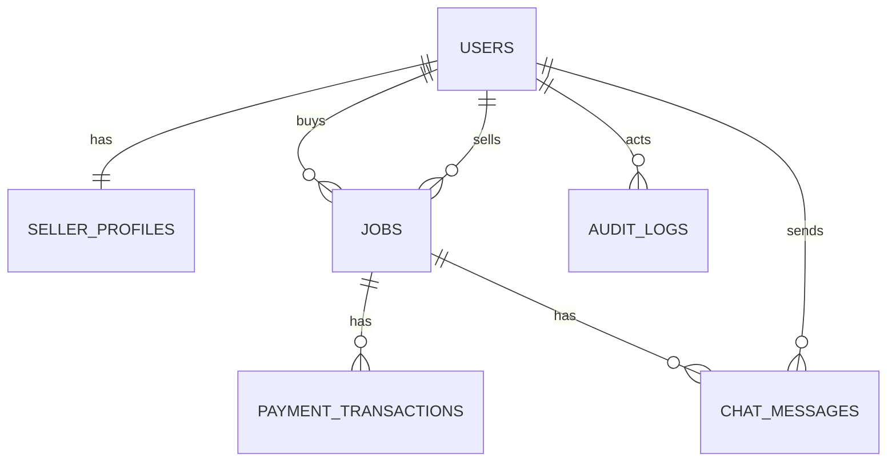

Lagos Service Hub — Database Schema

Overview
- Production-ready PostgreSQL schema using UUIDs, strong constraints, and indexes
- Supports Lagos-only location enforcement, role-based access, escrow flow, and auditability
- Tables: users, seller_profiles, jobs, payment_transactions, chat_messages, audit_logs

Entity Relationship Diagram (visual)



Entity Relationship Diagram (text)
- User 1—1 SellerProfile (only for role=seller)
- User 1—N Job (as buyer)
- User 1—N Job (as seller)
- Job 1—N PaymentTransaction
- Job 1—N ChatMessage
- User 1—N AuditLog (actor on actions)

Design Notes
- UUID primary keys via pgcrypto gen_random_uuid()
- Enumerations for roles, job status, transaction type/status, verification status, theme preference
- Idempotency keys on payment_transactions for webhook/event processing
- Lagos-only enforced via CHECK constraints on location fields
- Triggers to keep updated_at current on mutation

Complete DDL (migrations in SQL below)

```sql
CREATE EXTENSION IF NOT EXISTS pgcrypto;

CREATE TYPE role_enum AS ENUM ('buyer', 'seller', 'admin');
CREATE TYPE theme_enum AS ENUM ('system', 'light', 'dark', 'solarized', 'high_contrast', 'midnight');
CREATE TYPE job_status_enum AS ENUM ('proposed', 'funded', 'in_progress', 'partial_completed', 'completed', 'cancelled', 'disputed');
CREATE TYPE transaction_type_enum AS ENUM ('ESCROW_DEPOSIT', 'PAYOUT', 'REFUND', 'COMMISSION');
CREATE TYPE transaction_status_enum AS ENUM ('PENDING', 'CONFIRMED', 'FAILED');
CREATE TYPE verification_status_enum AS ENUM ('pending', 'verified', 'rejected', 'suspended');

CREATE TABLE users (
  id UUID PRIMARY KEY DEFAULT gen_random_uuid(),
  email TEXT NOT NULL,
  phone TEXT,
  password_hash TEXT NOT NULL,
  role role_enum NOT NULL DEFAULT 'buyer',
  first_name TEXT NOT NULL,
  last_name TEXT NOT NULL,
  state TEXT NOT NULL DEFAULT 'Lagos',
  city TEXT NOT NULL DEFAULT 'Lagos',
  address TEXT,
  theme_preference theme_enum NOT NULL DEFAULT 'system',
  is_active BOOLEAN NOT NULL DEFAULT TRUE,
  last_login_at TIMESTAMPTZ,
  created_at TIMESTAMPTZ NOT NULL DEFAULT NOW(),
  updated_at TIMESTAMPTZ NOT NULL DEFAULT NOW(),
  CONSTRAINT users_state_lagos CHECK (state = 'Lagos'),
  CONSTRAINT users_city_lagos CHECK (city = 'Lagos')
);

CREATE UNIQUE INDEX ux_users_email_lower ON users (LOWER(email));
CREATE UNIQUE INDEX ux_users_phone ON users (phone) WHERE phone IS NOT NULL;
CREATE INDEX idx_users_role ON users (role);

CREATE TABLE seller_profiles (
  id UUID PRIMARY KEY DEFAULT gen_random_uuid(),
  user_id UUID NOT NULL UNIQUE REFERENCES users(id) ON DELETE CASCADE,
  display_name TEXT NOT NULL,
  bio TEXT,
  categories TEXT[] NOT NULL,
  years_experience INTEGER NOT NULL DEFAULT 0,
  id_document_url TEXT,
  portfolio_url TEXT,
  verification_status verification_status_enum NOT NULL DEFAULT 'pending',
  verified_at TIMESTAMPTZ,
  verified_by UUID REFERENCES users(id) ON DELETE SET NULL,
  operating_state TEXT NOT NULL DEFAULT 'Lagos',
  rating_average NUMERIC(3,2) NOT NULL DEFAULT 0,
  rating_count INTEGER NOT NULL DEFAULT 0,
  created_at TIMESTAMPTZ NOT NULL DEFAULT NOW(),
  updated_at TIMESTAMPTZ NOT NULL DEFAULT NOW(),
  CONSTRAINT seller_profiles_state_lagos CHECK (operating_state = 'Lagos'),
  CONSTRAINT seller_profiles_rating_range CHECK (rating_average >= 0 AND rating_average <= 5)
);

CREATE INDEX idx_seller_profiles_verification_status ON seller_profiles (verification_status);
CREATE INDEX idx_seller_profiles_categories_gin ON seller_profiles USING GIN (categories);
CREATE INDEX idx_seller_profiles_rating ON seller_profiles (rating_average DESC);

CREATE TABLE jobs (
  id UUID PRIMARY KEY DEFAULT gen_random_uuid(),
  buyer_id UUID NOT NULL REFERENCES users(id) ON DELETE RESTRICT,
  seller_id UUID NOT NULL REFERENCES users(id) ON DELETE RESTRICT,
  seller_profile_id UUID NOT NULL REFERENCES seller_profiles(id) ON DELETE RESTRICT,
  title TEXT NOT NULL,
  description TEXT,
  category TEXT NOT NULL,
  status job_status_enum NOT NULL DEFAULT 'proposed',
  state TEXT NOT NULL DEFAULT 'Lagos',
  city TEXT NOT NULL DEFAULT 'Lagos',
  address TEXT,
  quoted_amount NUMERIC(12,2) NOT NULL CHECK (quoted_amount >= 0),
  agreed_amount NUMERIC(12,2) CHECK (agreed_amount >= 0),
  deposit_percentage NUMERIC(5,2) NOT NULL DEFAULT 70.00,
  commission_percentage NUMERIC(5,2) NOT NULL DEFAULT 10.00,
  funded_at TIMESTAMPTZ,
  started_at TIMESTAMPTZ,
  partial_completed_at TIMESTAMPTZ,
  completed_at TIMESTAMPTZ,
  disputed_at TIMESTAMPTZ,
  due_date TIMESTAMPTZ,
  created_at TIMESTAMPTZ NOT NULL DEFAULT NOW(),
  updated_at TIMESTAMPTZ NOT NULL DEFAULT NOW(),
  CONSTRAINT jobs_state_lagos CHECK (state = 'Lagos'),
  CONSTRAINT jobs_city_lagos CHECK (city = 'Lagos'),
  CONSTRAINT jobs_deposit_is_70 CHECK (deposit_percentage = 70.00),
  CONSTRAINT jobs_commission_is_10 CHECK (commission_percentage = 10.00)
);

CREATE INDEX idx_jobs_buyer_id ON jobs (buyer_id);
CREATE INDEX idx_jobs_seller_id ON jobs (seller_id);
CREATE INDEX idx_jobs_category ON jobs (category);
CREATE INDEX idx_jobs_status ON jobs (status);

CREATE TABLE payment_transactions (
  id UUID PRIMARY KEY DEFAULT gen_random_uuid(),
  job_id UUID NOT NULL REFERENCES jobs(id) ON DELETE CASCADE,
  buyer_id UUID REFERENCES users(id) ON DELETE SET NULL,
  seller_id UUID REFERENCES users(id) ON DELETE SET NULL,
  type transaction_type_enum NOT NULL,
  status transaction_status_enum NOT NULL DEFAULT 'PENDING',
  amount NUMERIC(12,2) NOT NULL CHECK (amount >= 0),
  currency TEXT NOT NULL DEFAULT 'NGN',
  paystack_reference TEXT,
  idempotency_key TEXT NOT NULL,
  commission_amount NUMERIC(12,2) NOT NULL DEFAULT 0 CHECK (commission_amount >= 0),
  escrow_amount NUMERIC(12,2) NOT NULL DEFAULT 0 CHECK (escrow_amount >= 0),
  released_amount NUMERIC(12,2) DEFAULT 0 CHECK (released_amount >= 0),
  released_at TIMESTAMPTZ,
  released_by UUID REFERENCES users(id) ON DELETE SET NULL,
  metadata JSONB NOT NULL DEFAULT '{}'::jsonb,
  created_at TIMESTAMPTZ NOT NULL DEFAULT NOW(),
  updated_at TIMESTAMPTZ NOT NULL DEFAULT NOW()
);

CREATE UNIQUE INDEX ux_payment_idempotency_key ON payment_transactions (idempotency_key);
CREATE UNIQUE INDEX ux_payment_paystack_reference ON payment_transactions (paystack_reference) WHERE paystack_reference IS NOT NULL;
CREATE INDEX idx_payment_job_id ON payment_transactions (job_id);
CREATE INDEX idx_payment_status ON payment_transactions (status);
CREATE INDEX idx_payment_type ON payment_transactions (type);

CREATE TABLE chat_messages (
  id UUID PRIMARY KEY DEFAULT gen_random_uuid(),
  job_id UUID NOT NULL REFERENCES jobs(id) ON DELETE CASCADE,
  sender_id UUID NOT NULL REFERENCES users(id) ON DELETE CASCADE,
  recipient_id UUID NOT NULL REFERENCES users(id) ON DELETE CASCADE,
  content TEXT NOT NULL,
  attachments JSONB,
  delivered_at TIMESTAMPTZ,
  read_at TIMESTAMPTZ,
  is_deleted BOOLEAN NOT NULL DEFAULT FALSE,
  created_at TIMESTAMPTZ NOT NULL DEFAULT NOW(),
  updated_at TIMESTAMPTZ NOT NULL DEFAULT NOW()
);

CREATE INDEX idx_chat_job_id ON chat_messages (job_id);
CREATE INDEX idx_chat_sender_id ON chat_messages (sender_id);
CREATE INDEX idx_chat_created_at ON chat_messages (created_at);

CREATE TABLE audit_logs (
  id UUID PRIMARY KEY DEFAULT gen_random_uuid(),
  actor_id UUID REFERENCES users(id) ON DELETE SET NULL,
  target_type TEXT NOT NULL,
  target_id UUID NOT NULL,
  action TEXT NOT NULL,
  metadata JSONB NOT NULL DEFAULT '{}'::jsonb,
  ip_address INET,
  user_agent TEXT,
  created_at TIMESTAMPTZ NOT NULL DEFAULT NOW()
);

CREATE INDEX idx_audit_target ON audit_logs (target_type, target_id);
CREATE INDEX idx_audit_actor ON audit_logs (actor_id);
CREATE INDEX idx_audit_created_at ON audit_logs (created_at);

CREATE OR REPLACE FUNCTION set_updated_at() RETURNS TRIGGER AS $$
BEGIN
  NEW.updated_at = NOW();
  RETURN NEW;
END;
$$ LANGUAGE plpgsql;

CREATE TRIGGER trg_users_updated_at BEFORE UPDATE ON users FOR EACH ROW EXECUTE FUNCTION set_updated_at();
CREATE TRIGGER trg_seller_profiles_updated_at BEFORE UPDATE ON seller_profiles FOR EACH ROW EXECUTE FUNCTION set_updated_at();
CREATE TRIGGER trg_jobs_updated_at BEFORE UPDATE ON jobs FOR EACH ROW EXECUTE FUNCTION set_updated_at();
CREATE TRIGGER trg_payment_transactions_updated_at BEFORE UPDATE ON payment_transactions FOR EACH ROW EXECUTE FUNCTION set_updated_at();
CREATE TRIGGER trg_chat_messages_updated_at BEFORE UPDATE ON chat_messages FOR EACH ROW EXECUTE FUNCTION set_updated_at();
```

Relationships Summary
- users → seller_profiles: 1:1 via seller_profiles.user_id (unique FK)
- users → jobs (buyer): 1:N via jobs.buyer_id
- users → jobs (seller): 1:N via jobs.seller_id
- jobs → payment_transactions: 1:N via payment_transactions.job_id
- jobs → chat_messages: 1:N via chat_messages.job_id
- users → audit_logs: 1:N via audit_logs.actor_id

Indexes (high-value)
- ux_users_email_lower: case-insensitive email uniqueness
- idx_jobs_category, idx_jobs_status: fast search/filter
- idx_payment_job_id, idx_payment_status: transaction lookup and monitoring
- idx_chat_job_id: job-scoped chat retrieval
- idx_seller_profiles_categories_gin: category filters with GIN
- idx_audit_target: targeted audit queries

Sample Data (for testing)

```sql
WITH admin_user AS (
  INSERT INTO users (email, password_hash, role, first_name, last_name)
  VALUES ('admin@lagosservicehub.ng', 'admin_pwd_hash', 'admin', 'Admin', 'User')
  RETURNING id
),
buyer_user AS (
  INSERT INTO users (email, password_hash, role, first_name, last_name)
  VALUES ('buyer1@lagosservicehub.ng', 'buyer_pwd_hash', 'buyer', 'Bola', 'Ade')
  RETURNING id
),
seller_user AS (
  INSERT INTO users (email, password_hash, role, first_name, last_name)
  VALUES ('seller1@lagosservicehub.ng', 'seller_pwd_hash', 'seller', 'Tunde', 'Okoro')
  RETURNING id
),
profile AS (
  INSERT INTO seller_profiles (user_id, display_name, categories, years_experience, verification_status)
  SELECT seller_user.id, 'Tunde Electrics', ARRAY['electrical','maintenance'], 5, 'verified'
  FROM seller_user
  RETURNING id
),
job AS (
  INSERT INTO jobs (buyer_id, seller_id, seller_profile_id, title, category, status, quoted_amount, agreed_amount, funded_at)
  SELECT buyer_user.id, seller_user.id, profile.id, 'Fix wiring issue', 'electrical', 'funded', 50000, 50000, NOW()
  FROM buyer_user, seller_user, profile
  RETURNING id
),
payment AS (
  INSERT INTO payment_transactions (job_id, buyer_id, seller_id, type, status, amount, currency, idempotency_key, commission_amount, escrow_amount)
  SELECT job.id, buyer_user.id, seller_user.id, 'ESCROW_DEPOSIT', 'CONFIRMED', 35000, 'NGN', 'demo-deposit-001', 5000, 35000
  FROM job, buyer_user, seller_user
  RETURNING id
),
chat AS (
  INSERT INTO chat_messages (job_id, sender_id, recipient_id, content)
  SELECT job.id, buyer_user.id, seller_user.id, 'Hi, please confirm visit time'
  FROM job, buyer_user, seller_user
  RETURNING id
)
INSERT INTO audit_logs (actor_id, target_type, target_id, action, metadata)
SELECT admin_user.id, 'Job', job.id, 'escrow_release_review', jsonb_build_object('status','funded')
FROM admin_user, job;
```

Migration Scripts
- See SQL files under db/migrations
  - 0001_init.sql: schema, types, tables, indexes, triggers
  - 0002_seed.sql: sample data

How to apply (example)

```bash
psql "<your-connection-string>" -f db/migrations/0001_init.sql
psql "<your-connection-string>" -f db/migrations/0002_seed.sql
```

